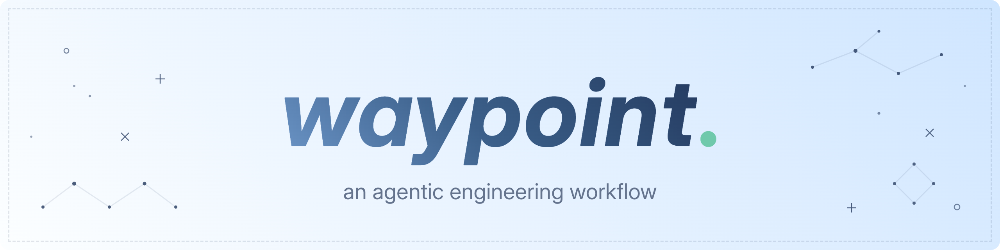

# waypoint

An opinionated workflow for agentic engineering. Guides you and your agents from problem discovery to production-ready code.

## 🚀 Getting Started

Install using the [Vercel Skills CLI](https://github.com/vercel-labs/skills):

```bash
npx skills add m-borgmann/waypoint
```

Or install the skills from this repository into your agent's skills directory.

## ✨ Why choose waypoint?

*waypoint* was built for the **agentic engineer** who wants to stay involved throughout the development cycle. It is not designed for unsupervised vibe coding, as it assumes a human is present at every phase. This makes it intentionally closer to traditional software engineering. It borrows the discipline of established practices while embracing the speed and leverage that modern language models provide.

With just a handful of user-invoked skills, the workflow is lightweight to adopt while remaining thorough where it matters. Rather than telling the model *how to think*, *waypoint* tells it *what to produce*. Each skill has a well-defined output, making the workflow predictable, composable, and easy to review. Every meaningful decision stays with a human.

## 🧭 Workflow

Every change moves through five phases. Each phase produces an artifact that downstream phases consume.

1. `waypoint-align`: clarifies requirements and user intent. Produces an *Alignment Brief*.
2. `waypoint-plan`: designs an implementation approach against the existing codebase. Produces an *Implementation Plan*.
3. `waypoint-build`: executes tasks one at a time, verifying after each. Produces an *Implementation Report*.
4. `waypoint-review`: evaluates quality and strips away unnecessary complexity. Produces a *Review Report*.
5. `waypoint-ship`: generates changelog, commit message, and PR description. Produces a *Release Package*.

The waypoint skill serves as an entry point, routing requests to the appropriate phase based on the available artifacts, so you can take a break and resume work exactly where you left off.

All skills follow the [Agent Skills](https://agentskills.io/home) format.

## 🌟 Best Practices

Start each phase in a **new chat** with a fresh context window. Pass the issue or ticket identifier when available alongside any additional information you like.

```
/waypoint-align ABC-123 but ignore the last comment by john doe
```

Or invoke the router and let it determine the next phase automatically:

```
/waypoint ABC-123
```

All phases are **user-invocable only** so each phase starts deliberately, not opportunistically.

### Recommended Tooling

waypoint works best alongside tools that give agents access to real project context:

| Tool | Purpose |
| ---- | ------- |
| [Atlassian MCP](https://support.atlassian.com/atlassian-rovo-mcp-server/docs/getting-started-with-the-atlassian-remote-mcp-server/) | Issue and ticket retrieval |
| [GitHub MCP](https://github.com/github/github-mcp-server) | Pull requests, checks, and repository context |
| Browser MCP | End-to-end verification and UI testing |
| Framework-specific MCPs | Docs and APIs for your stack |

Tune skills to match your team's conventions such as branch naming, CI commands and review standards before adopting waypoint on a project.

## 📚 Artifacts

All workflow outputs are stored in the project workspace:

```
.waypoint/{ticket-slug}/{phase}/{YYYY-MM-DD}.md
```

- `{ticket-slug}` — derived from the issue key (e.g. `ABC-123` → `abc-123`)
- `{phase}` — `align`, `plan`, `build`, `review`, or `ship`
- If an artifact for the same date already exists, it is updated in place

Artifacts are the contract between phases and between agents.

Add `.waypoint/` to your project's `.gitignore` if you do not want artifacts in version control.

## 💫 Roadmap

- [ ] Coming Soon

## 💡 Acknowledgments

*waypoint* draws inspiration from practitioners and research across agentic software engineering:

- Addy Osmani, Shubham Saboo, and Sokratis Kartakis: [The New SDLC With Vibe Coding](https://www.kaggle.com/whitepaper-the-new-SDLC-with-vibe-coding)
- Matt Pocock: [Skills For Real Engineers](https://github.com/mattpocock/skills)
