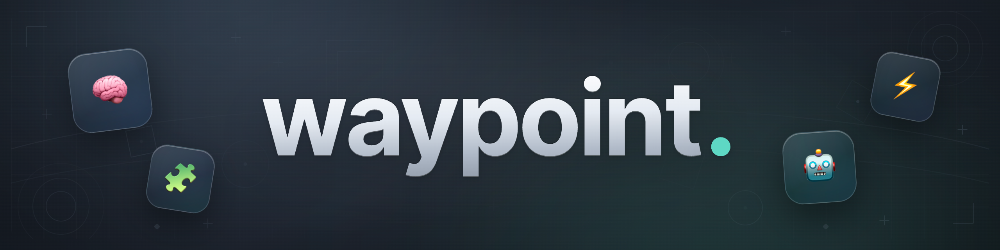

<div align="center">

An opinionated **workflow for agentic engineering**.  
Guides you and your agents from problem discovery to production-ready code.

</div>

---

## 🚀 Getting Started

Install by using Vercel's [Skills CLI](https://github.com/vercel-labs/skills). When prompted, enable every agent you plan to use that supports the [Agent Skills](https://agentskills.io/home) format:

```bash
npx skills add m-borgmann/waypoint --skill '*'
```

Or manually copy the skills from this repository into your agent's `skills` directory.

> [!IMPORTANT]
> Only optional actions may be omitted during installation. All other skills are required for the workflow to function as intended.

## ✨ Why waypoint?

*waypoint* was made for the **agentic engineer** who wants to stay involved throughout the development cycle. It is not designed for unsupervised vibe coding — a human is expected at every action. It borrows the discipline of established software engineering practices while embracing the speed and leverage that modern language models provide.

With just a handful of user-invoked skills, the workflow is lightweight to adopt while remaining thorough where it matters. Rather than telling the model *how to think*, it tells it *what to produce*. Each skill has a well-defined output, making the workflow predictable, composable, and easy to review. Every meaningful decision stays with a human.

## 🧭 The Workflow

> **Entry Point**

Each skill can be deliberately invoked or routed to by the default skill:

- `waypoint` classifies each request as **Progress**, **Revision**, or **Optional**, then routes accordingly.

The workflow is organized around **actions**. An action is a discrete unit of work that, in most cases, produces an artifact.

> **Core Actions**

They are the default progression. Their artifacts are consumed by later actions:

1. `waypoint-align` clarifies requirements and user intent.
    - Produces `align.md`
2. `waypoint-plan` designs an implementation approach against the existing codebase.
    - Produces `plan.md`
3. `waypoint-build` executes tasks one at a time, verifying after each.
    - Produces `build.md`
4. `waypoint-review` runs a living findings loop until no open blocking issues remain.
    - Produces `review.md`

> **Optional Actions**

They are not always required and sit outside the core progression. Invoke them when needed:

- `waypoint-ship` generates changelog, commit message options, and PR description.
  - Produces `ship.md`

> **Utility Actions**

They are shared helpers used by other actions. Some are used automatically, some may be invoked intentionally:

- `waypoint-artifact` creates, validates, and keeps workflow artifacts in sync.

> [!NOTE]
> All skills use the `disable-model-invocation: true` extension, so agents that support it won't try to match your intent and start them opportunistically from ambient context. They run when you invoke them or when another skill routes or delegates to them.

> [!TIP]
> You may tune the skills to match your team's conventions and preferences.

## 🌟 Best Practices

Either directly invoke a specific action and pass the issue key alongside any additional information you like:

```
/waypoint-align ABC-123 but ignore the last comment by john doe
```

Or invoke the router and let it determine the correct action:

```
/waypoint ABC-123
```

```
/waypoint ABC-123 make the primary button blue
```

> [!IMPORTANT]
> Start each action in a **new chat** with a fresh context window. Existing artifacts provide relevant context, no handoff required.

## 🛠️ Recommended Tooling

*waypoint* works best alongside tools that give agents access to real project context:

| Tool | Purpose |
| ---- | ------- |
| [Atlassian MCP](https://support.atlassian.com/atlassian-rovo-mcp-server/docs/getting-started-with-the-atlassian-remote-mcp-server/) | Issue and ticket retrieval |
| [Figma MCP](https://developers.figma.com/docs/figma-mcp-server/) | Design context and design-to-code |
| [GitHub MCP](https://github.com/github/github-mcp-server) | Pull requests, checks, and repository context |
| Browser | End-to-end UI self-verification |

## 📚 Artifacts

All workflow outputs make up the contract between actions and between agents. They are stored in the project workspace:

```
.waypoint/{slug}/{action}.md
```

- `{slug}` — derived from the issue key (e.g. `ABC-123`)
- `{action}` — `align`, `plan`, `build`, `review`, `ship`, or another action key
- There is one living file for each action
- Follow-ups and revisions keep affected artifacts in sync with the newest agreed state

> [!NOTE]
> Add `.waypoint/` to your project's `.gitignore` if you do not want artifacts in version control.

## 💫 Roadmap

- [ ] Coming Soon

## 💡 Acknowledgments

*waypoint* draws inspiration from practitioners and research across agentic software engineering:

- Addy Osmani, Shubham Saboo, and Sokratis Kartakis: [The New SDLC With Vibe Coding](https://www.kaggle.com/whitepaper-the-new-SDLC-with-vibe-coding)
- Thariq Shihipar, Anthropic Technical Staff: [The new rules of context engineering](https://claude.com/blog/the-new-rules-of-context-engineering-for-claude-5-generation-models)
- Harjot Gill, CEO of Code Rabbit: [Code is no longer the bottleneck. Understanding is.](https://www.coderabbit.ai/blog/code-is-no-longer-the-bottleneck-understanding-is)
- Matt Pocock: [Skills For Real Engineers](https://github.com/mattpocock/skills)

---

<div align="center">

Made with ❤️ by [Magnus Borgmann](https://github.com/m-borgmann)

</div>
